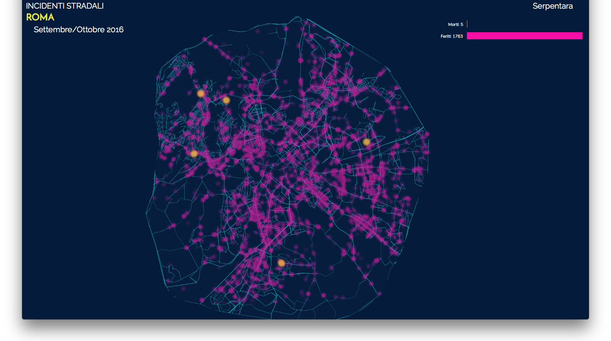

## Through the streets of Rome - Data Visualization

Git repository hosting the thesis project for the course ***"L'estetica dei Flussi: Open and Big Data Visualization"*** I attended at Rufa University on fall 2016.

The repository hosts the data and the code necessary to render the svg visualization. The code is written using the [d3.js](https://d3js.org)  framework.

Initially the heatmap was plotted using the [heatmap.js](https://www.patrick-wied.at/static/heatmapjs/) library but due to zooming conflicts (the library draws on the canvas while d3js draws on a svg) I managed to build the heatmap in d3js.

### Screenshot:

## Tools used
[Mapshaper](http://mapshaper) was a huge help for simplifying paths data!
